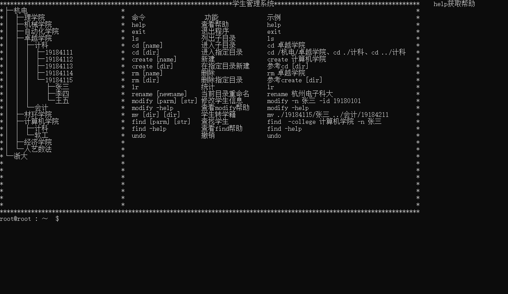
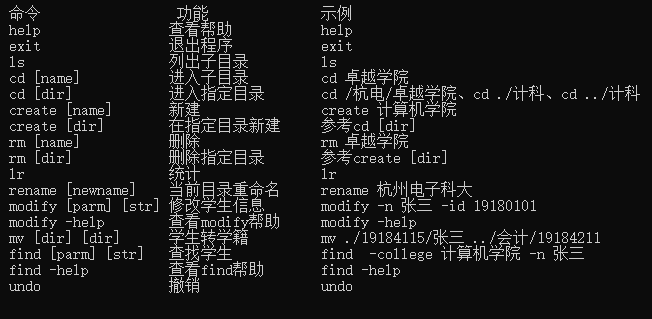
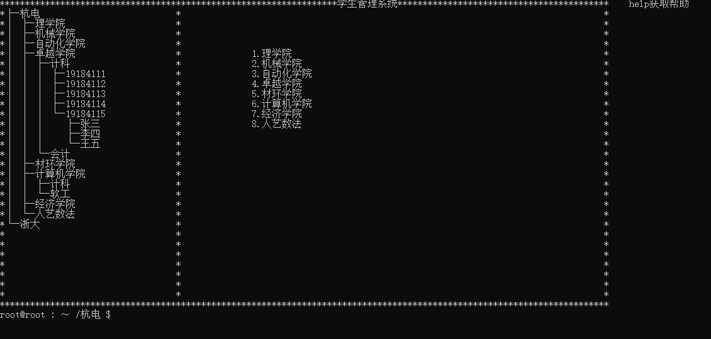
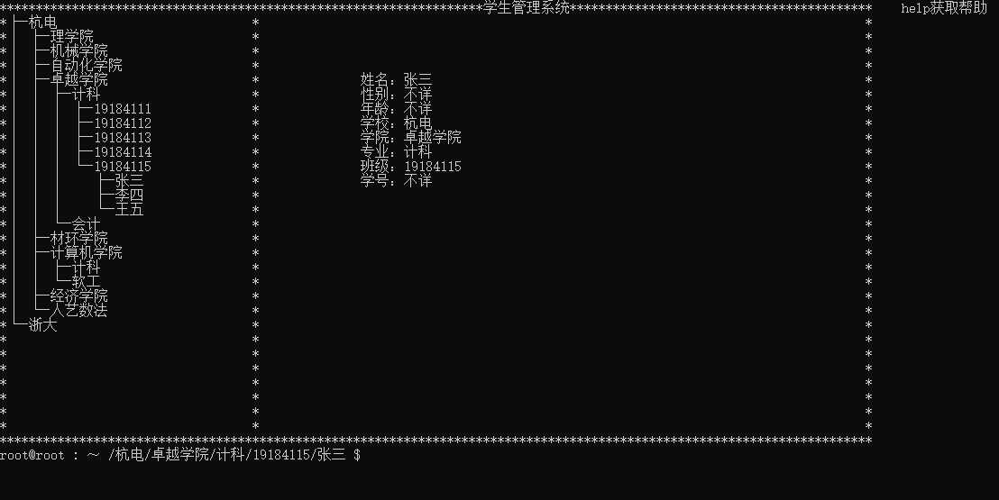
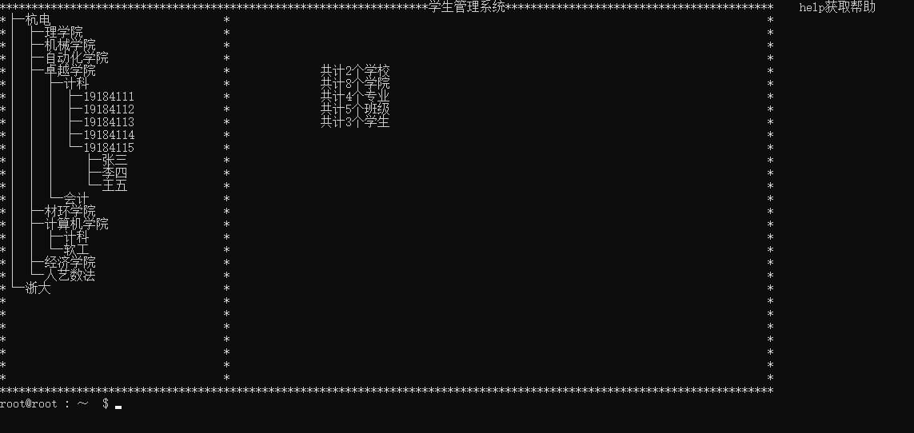
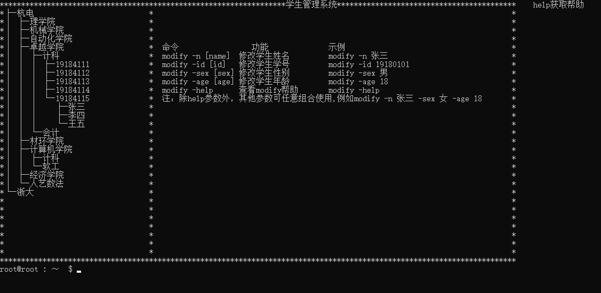
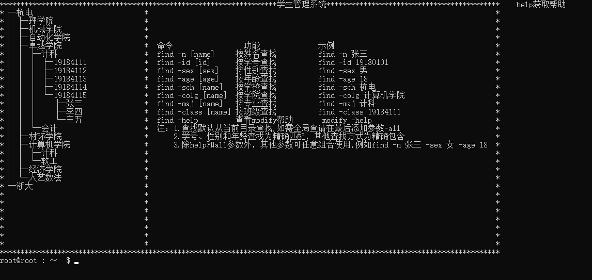
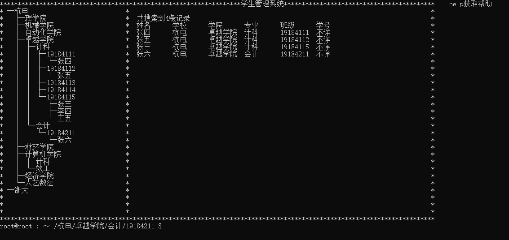

# Student-management-system
数据结构作业 有撤销功能的树状学生管理系统

**注：除main.c、print.c、command.c为GB2312编码,其他文件皆为UTF-8编码**

main.exe为执行文件  

main.c 为主程序模块  

stack.h 栈模块，包含撤销栈数据结构的定义及相关函数声明  
stack.c 栈模块相关函数定义  

student.h 学生模块，包含学生数据结构的定义  

print.h 界面模块,包含界面绘制相关变量及函数声明  
print.c 界面模块,包含界面绘制相关变量及函数定义  

command.h 命令模块，包含学生管理系统所使用的命令相关的变量及函数声明  
command.c 命令模块，包含学生管理系统所使用的命令相关的变量及函数定义 

# 使用说明
由于界面采用局部刷新的方式，进入系统前请最大化窗口，防止出现文字重叠错乱的情况，并按回车进入系统  
  
界面左侧显示树形的目录(默认暂不支持更改)，右侧则根据不同的命令显示不同的信息，默认是help帮助界面  
  
整个系统采用类似ubuntu命令行的方式进行控制，所有的操作都通过输入命令来完成，命令总共有12种，涵盖包括增删改查统计撤销各个方面的功能。下面是各种命令的详细介绍:  

## help
由于采用的是命令行的方式，所以初学者可能比较难以操作，所以我们提供help命令可以随时查看有哪些命令，对于比较复杂的命令，还有单独的详细帮助。    
  
## exit
退出程序  
## ls
显示当前目录的子目录。  
  
如果当前目录是学生则显示学生信息。  
  
## cd  
本系统最重要的命令之一，也是许多操作的基础，可以将当前目录切换到任意的目录  
主要有三种使用方式。  
第一种`cd [name]` ，可以切换到当前目录的子目录，例如在`/杭电`目录下使用`cd 卓越学院`,当前目录就会切换到`卓越学院`,即当前目录所在路径变为``/杭电/卓越学院``。  
第二种绝对路径 `cd [dir]`,通过类似文件路径的方式，可以直接进入任意的目录`cd \`就是进入根目录，`cd \杭电\卓越学院`,就是进入`杭电\卓越学院`目录。  
第三种相对路径 用法和上一种相同，只不过是后面的路径采用相对路径，例如 `cd ..`进入当前目录的父目录，如果当前目录处于`/杭电/卓越学院`,则通过`cd ../计算机学院`就可以进入`/杭电/计算机学院`目录,`.`表示当前目录，例如当前目录为`/杭电/卓越学院`时通过`cd ./计科/19184115/张三`就可以查看张三这个学生的信息。  
## create
create命令操作方法和cd命令相同，这里就不再详细介绍，该命令的作用就是，在指定目录创建一个新的目录，如果是创建学生的话，只有学生的姓名，其他如学号、性别和年龄需要另外修改添加。  
另外在同一个目录中，无法创建具有相同名字的子目录。  
同时使用路径创建新目录时，需要保证路径的前半部分存在，例如`create /杭电/卓越学院/机械`，需要保证`/杭电/卓越学院`这一目录存在，暂不支持一次性创建多层级。  
## rm
create命令的逆操作，用法也基本相同。  
同样的,在使用rm命令时，需要保证整个路径都是存在的，才能完成删除，并且需要注意的是，根目录是无法删除的。   
## lr
统计命令，统计当前目录下的子目录的数量,因此使用前，请先通过cd命令进入想要统计的目录    

## rename
修改当前目录的名字，方法很简单`rename 新名字`，但请注意，同一目录下不要出现同名的情况。  
## modify
修改学生信息，是本系统最复杂的两个命令之一，因此提供了单独的帮助，使用方法只需输入`modify -help`  
  
虽然看着复杂，但其实使用起来也很简单，学生的个人信息只有四个姓名、学号、性别和年龄，通过不同的参数来表示不同的属性，比如`-n`表示姓名，`-id`表示学号，`-sex`表示性别，`-age`表示年龄，使用时只需要使用modify命令，后面跟上要修改的信息对应的参数和修改后的值即可。例如如果要修改学生的姓名和学号，只要`modify -n 新名字 -id 新学号`即可，四种参数可以任意组合或单独使用。  
还需要注意的是，必须保证一个参数一个值一一对应，不能有匹配不上的情况。  
另外学号和年龄必须保证是不为0的数字，不能出现其他字符，性别必须为男或女，不得出现其他情况，否则将会修改失败  
最后一个注意点是，使用该命令时必须进入学生的目录才可以使用，在其他目录，仅`modify -help`可以使用  
## mv
学生学籍移动，用法为`mv 学生当前路径 移动后的路径`,路径用法同cd的三种方式  
只有一个注意点，第一个路径必须是一个学生的路径，第二个路径必须是一个班级的路径，不能将学生移到高等级的目录  
## find
本系统最复杂的命令，学生查找，同样的提供了单独的帮助`find -help`  
  
用法和modify类似，采用了参数组合的方式来满足不同的查找需要，这次不再一一列举  
注意事项已在help中列出，默认是在当前目录查找，如需全局查找，必须在最后加上-all参数  
除了学号、年龄和性别必须是完全匹配，其他的只需要包含即可  
例如全局查找所有姓张的只需要`find -n 张 -all`  
  
## undo
最后undo是撤销命令，可以撤销create、rm、rename、modify、mv命令操作带来的修改，并支持无限撤销  

# 6.1
修复了第一次修改学生性别、年龄或学号无法撤回的bug  

# 6.0
新增undo命令  

# 5.0
新增modify命令  
新增mv命令  
新增find命令  

# 4.0
新增rm命令  
重写了create、cd命令，支持绝对路径与相对路径  
修改lr命令  
去除了addschool、addcollege、addmajor、addclass、addstudent命令，原有功能由create替代    

# 3.0
新增lr命令  
ls新增显示学生信息功能  

# 2.0
新增cd命令  
新增create命令  
新增addschool命令  
新增addcollege命令  
新增addmajor命令  
新增addclass命令  
新增addstudent命令  
重构了绘制树的函数  

# 1.0
界面绘制  
新增help命令  
新增ls命令  
新增exit命令  

